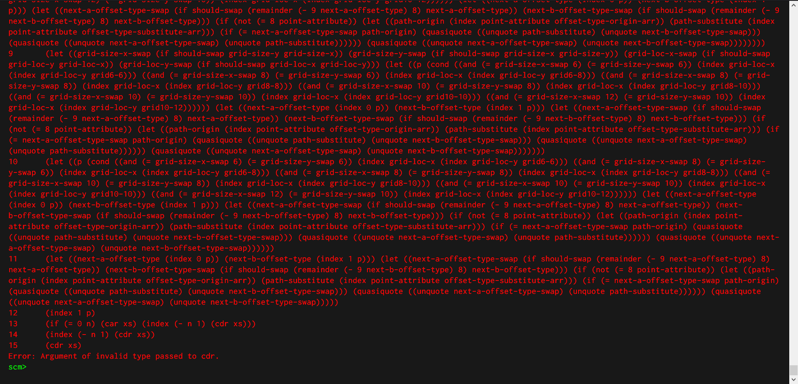

# CS 61A

sgal's solution for CS 61A: Structure and Interpretation of Computer Programs, Summer 2019

## Contents

* Labs: 00-06, 08-13
* Homework: 01-04, 06, 07
* Projects:
    - Hog, Hog revise, Hog Contest
    - Typing Test, Typing Test revise
    - Ants, Ants revise
    - Scheme

Not Included:

* Lab 07: Midterm Review
* Lab 14: Final Review
* Homework 00: Survey and Syllabus Quiz
* Homework 05: Mid-Semester Survey
* Homework 08: Online Survey, Course Evaluations and Vote for Scheme Art Contest

Not Implemented:

* Lab 11 and 12 (Optional Problems)
* Scheme (Extra Credit) and Scheme Contest

## Python One-liners

I write a lot of Python one-liners.

Nearly all the Python homework and labs are implemented in one line.

### Why

Some problems are required to be solved in one line, like [here](https://inst.eecs.berkeley.edu/~cs61a/su19/lab/lab02/#q3), [here](https://inst.eecs.berkeley.edu/~cs61a/su19/hw/hw02/#q1), [**here**](https://inst.eecs.berkeley.edu/~cs61a/su19/hw/hw02/#q8) (yes, the Y combinator) and [here](https://inst.eecs.berkeley.edu/~cs61a/su19/lab/lab04/#q8). But why not others?

### Why is it possible?

#### Basic Ideas

**Assignment statements can be turned into lambdas.**

```python
a = 1
print(a)
```

```python
(lambda a: print(a))(1)
```

**Function definitions can be turned into lambdas.**

```python
def foo(arg1, arg2, *args, **kwargs):
    print(arg1, arg2, args, kwargs)
foo(1, 2, 3, 4, bar=5, baz=6)
```

```python
foo = lambda arg1, arg2, *args, **kwargs: print(arg1, arg2, args, kwargs)
```

**If statement can be turned into if expressions.**

```python
if a > 0:
    print(1)
elif a < 0:
    print(-1)
```

```python
print(1) if a > 0 else print(-1) if a < 0 else None
```

**Two statements can be merged into one.**

```python
foo(4)
bar(2)
```

```python
(foo(4) and None) or bar(2)
```

**Y combinator rescues the recursion.**

Homework 02

```python
def pingpong(n):
    Y = lambda f: (lambda x: x(x))(lambda x: f(lambda n: x(x)(n)))
    should_reverse = lambda x: x % 7 == 0 or '7' in str(x)
    helper = lambda f: lambda i: lambda is_up: lambda acc: (lambda is_up: acc if i == n else f(i + 1)(is_up)(acc + 1 if is_up else acc - 1))(not is_up if should_reverse(i) else is_up)
    return Y(helper)(1)(True)(1)
```

**Even the import statement can be one-lined (although I did not do that).**

```python
import sys
sys.stdout.write('Hello!\n')
```

```python
(lambda sys: sys.stdout.write('Hello!\n'))(__import__('sys'))
```

#### Brain-Storming Ideas

**Example 01**

Homework 04

```python
def make_fib():
    """Returns a function that returns the next Fibonacci number
    every time it is called.

    >>> fib = make_fib()
    >>> fib()
    0
    >>> fib()
    1
    >>> fib()
    1
    >>> fib()
    2
    >>> fib()
    3
    >>> fib2 = make_fib()
    >>> fib() + sum([fib2() for _ in range(5)])
    12
    """
    from itertools import accumulate, chain, repeat
    return map(lambda x_y: x_y[0], accumulate(chain(((0, 1),), repeat(None)), lambda x_y, _: (x_y[1], x_y[0] + x_y[1]))).__next__
```

Which could be further one-lined as:

```python
make_fib = lambda: (lambda itertools: map(lambda x_y: x_y[0], itertools.accumulate(itertools.chain(((0, 1),), itertools.repeat(None)), lambda x_y, _: (x_y[1], x_y[0] + x_y[1]))).__next__)(__import__('itertools'))
```

**Example 02**

Another Homework 04, using `setattr`

```python
def make_withdraw(balance, password):
    def withdraw(f):
        def inner(amount, attempt_password):
            None if hasattr(f, 'new_balance') else setattr(f, 'new_balance', balance)
            None if hasattr(f, 'fail_count') else setattr(f, 'fail_count', 0)
            None if hasattr(f, 'attempts') else setattr(f, 'attempts', [])

            if f.fail_count == 3:
                return 'Your account is locked. Attempts: ' + str(f.attempts)
            elif attempt_password != password:
                setattr(f, 'attempts', f.attempts + [attempt_password])
                setattr(f, 'fail_count', f.fail_count + 1)
                return 'Incorrect password'
            elif amount > f.new_balance:
                return 'Insufficient funds'
            else:
                setattr(f, 'new_balance', f.new_balance - amount)
                return f.new_balance
        return inner
    return withdraw(withdraw)
```

Which could be one-lined as:

```python
make_withdraw = lambda balance, password: (lambda f: lambda x, y: f(x)(y))((lambda f: (lambda x: x(x))(lambda x: f(lambda n: x(x)(n))))(lambda f: lambda amount: lambda attempt_password: (None if hasattr(f, 'new_balance') else setattr(f, 'new_balance', balance)) or (None if hasattr(f, 'fail_count') else setattr(f, 'fail_count', 0)) or (None if hasattr(f, 'attempts') else setattr(f, 'attempts', [])) or (('Your account is locked. Attempts: ' + str(f.attempts)) if f.fail_count == 3 else setattr(f, 'attempts', f.attempts + [attempt_password]) or setattr(f, 'fail_count', f.fail_count + 1) or 'Incorrect password' if attempt_password != password else 'Insufficient funds' if amount > f.new_balance else setattr(f, 'new_balance', f.new_balance - amount) or f.new_balance)))
```

## Detailed `.gitignore`

The original archive contains the code skeleton, the OK autograder and other utilities. The detailed `.gitignore` files help filter away the unmodified parts.

## Why Isn't Scheme Art Implemented?

I tried to do so.


